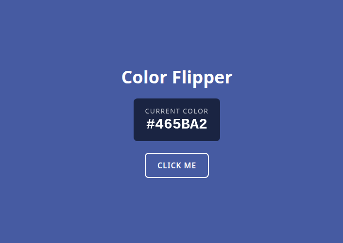

# Color Flipper

A color flipper built with Angular 19 and Tailwind CSS. Click the button to generate a random background color, with the hex code displayed and text contrast adjusted automatically.



## Running locally

```bash
npm install
npm start
```
